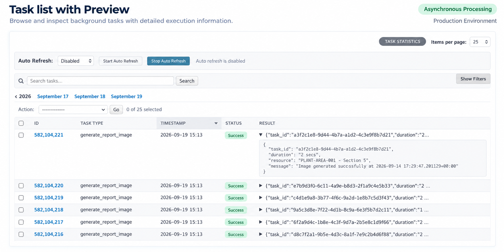
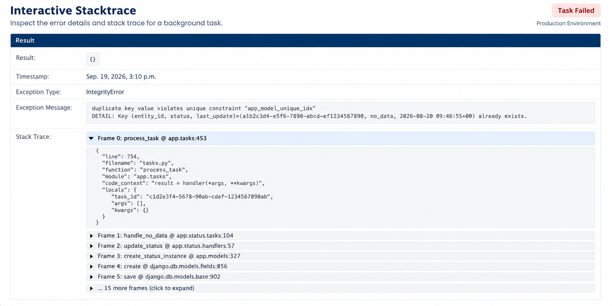
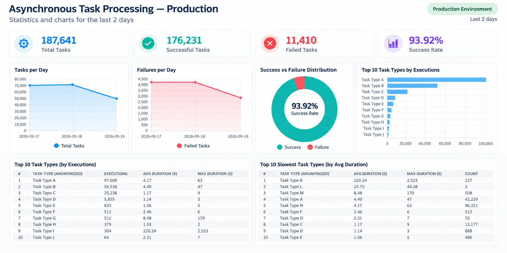

Admin
=====

Task logs
---------

The ``TaskLog`` admin lists task executions with task name, timestamp, status,
and a JSON result preview. Filters include status, timestamp, task name, and
queue.

The list page also includes:

* A shortcut to the statistics dashboard.
* Configurable page size.
* Collapsible filters that free more screen space for the task list.
* Auto-refresh controls for 5, 10, 30, and 60 second intervals.

The result preview helps teams scan recent executions directly from the list,
without opening every task detail page.

Task detail
-----------

The task detail page is read-only and shows:

* Task id, task name, periodic task name, queue, worker, and status.
* Args and kwargs.
* Pretty JSON result output.
* Exception type and message for failures.
* Interactive traceback details.

Failed task details include the full stacktrace and sanitized context variables
captured at the moment of the error. This makes debugging production failures
faster because the relevant local state is available alongside the traceback.

Task rerun
----------

The detail page includes a "Re-run Task" action. It sends the original task
name, args, kwargs, and queue back to Celery using the current Celery app.

Statistics
----------

The ``TaskLogStatistics`` proxy model exposes an admin dashboard with cards,
charts, and tables for operational monitoring:

* Total tasks.
* Successful and failed tasks.
* Success rate.
* Average and maximum duration.
* Average messages per day, hour, and minute.
* Tasks and failures per day.
* Success vs failure distribution.
* Top queues.
* Worker distribution.
* Periodic task distribution.
* Top tasks.
* Slowest tasks.
* Top error messages.

The dashboard gives teams a quick operational view of Celery throughput,
failures, queue distribution, workers, periodic tasks, slow tasks, and common
errors.

